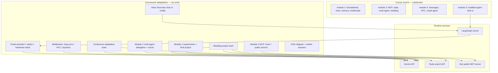

# Week 3 Agent Engineering Lab

Practical coursework by Abdelmalek Beladam submitted to the Thirduni programme. The work covers Gemini-based agent experiments across model/tool fundamentals, runtime state and memory, MCP integration, multi-agent delegation, middleware lifecycle hooks, human-in-the-loop approval, and a hardened email assistant.

**Repository Structure & Scope Boundary:**
- **Upstream Course Material**: Original sample notebooks and reference assets are retained under `notebooks/module-1/`, `notebooks/module-2/`, and `notebooks/module-3/` with original LangChain copyright and MIT notices preserved.
- **Coursework Adaptations & Experiments**: Independent implementations, custom multi-agent workflows, security attack suites, and execution evidence logs reside under `my-work/`.
- **Modified Agent Chat UI**: The web frontend under `notebooks/module-3/agent-chat-ui/` is a modified adaptation of LangChain's Agent Chat UI (adapted as "Inbox Doorman", wired to the local email assistant agent, with reconstructed helper components; its original MIT licence is preserved). No course screenshots are included in this repository.

---

## Navigation

| Document | Purpose |
|---|---|
| [docs/EVIDENCE.md](docs/EVIDENCE.md) | Evidence index: implementation paths and saved output files per project |
| [docs/TESTING.md](docs/TESTING.md) | Executed tests, static checks, known failures, and limitations |
| [COURSE_README.md](COURSE_README.md) | Original course companion README |
| [GitHub Repository](https://github.com/Abdelmalek-Beladam/thirduni-week3-agents) | Public repository |

---

## Projects

| Project | Purpose | Implementation | Saved evidence |
|---|---|---|---|
| Module 1 experiments | Foundational model, tools, memory, multimodal calls | `my-work/foundational_models_experiment.ipynb`, `tools_experiment.ipynb`, `short_term_memory_experiment.ipynb`, `multimodal_messages_experiment.ipynb` | Notebook cells with populated outputs |
| Module 1 final project | Personal chef and conference rehearsal agents | `my-work/module1_final_project/chef_agent.py`, `conference_rehearsal_agent.py` | `demo.ipynb` |
| Module 2 MCP | Local and public MCP server integration | `my-work/module2_mcp/presentation_timing_server.py`, `local_mcp_demo.py`, `public_mcp_demo.py` | `local_mcp_terminal_output.txt`, `public_mcp_terminal_output.txt`, `demo.ipynb` |
| Module 2 context/state | Runtime context and checkpointed state | `my-work/module2_context_state/demo.ipynb` | Notebook cells |
| Module 2 multi-agent | Agent-to-agent task delegation with callback tracing | `my-work/module2_multi_agent/run_demo.py`, `local_trace.py` | `demo_output.txt`, `traces/stage1_trace.json`, `traces/stage3_trace.json` |
| Module 2 wedding project | Multi-agent wedding planner (Kiwi, Chinook, Tavily) | `my-work/module2_wedding_project/wedding_team.py`, `run_wedding_demo.py` | `wedding_demo_output.txt`, failure files, state snapshots, traces |
| Module 2 conference adaptation | Conference-preparation team adapted from wedding project | `my-work/module2_conference_team/conference_team.py`, `run_conference_demo.py` | `conference_demo_output.txt`, corrected/pre-correction runs, traces |
| Module 3 middleware | Long conversations, human-in-the-loop, dynamic agents | `my-work/module3_middleware/long_conversations.py`, `hitl.py`, `dynamic_agents.py` | `long_conversations_output.txt`, `hitl_output.txt`, `dynamic_agents_output.txt` |
| Module 3 email assistant (Inbox Doorman) | Email agent with auth, approval gating, and prompt-injection attacks | `my-work/module3_email_assistant/email_assistant.py`, `attack_email_assistant.py`, `retest_hardened.py` | `attack_output.txt`, `retest_hardened_output.txt` |
| Module 3 chat UI (Inbox Doorman UI) | Modified Agent Chat UI configured for the email assistant | `my-work/module3_chat_ui/server_agent.py`, `langgraph.json` | Frontend renders; browser message submission unresolved; no outside-tester session |
| Module 3 RAG | RAG pipeline diagram, need assessment, silent-failure answer | `my-work/module3_rag/rag_pipelines.png`, `README.md` | Diagram and written answers; no implementation claimed |

---

## Architecture overview



---

## Key observed findings

The following findings are drawn from saved execution outputs and are not inferred.

- **Summarisation trade-off.** Summarisation reduced conversation state from 12 to 3 messages in the long-conversation test, but increased input tokens on that short example (284 vs 167) because the summary was longer than the original messages. The summary also distorted one fact, changing "night deliveries" to "24/7 delivery service".

- **Before-agent hook.** Removing a sensor tool result via a `before_agent` hook prevented the value from appearing in the response. Input tokens fell from 129 to 116. The Gemini API requirement that every function call be followed by its result meant the paired AI message also had to be removed.

- **Human-in-the-loop gating.** Approve, reject-with-reason, and edit behaviours operated correctly against a dummy feedback tool. An email-send call was blocked despite a simulated prior approval in the prompt.

- **Prompt-injection attack and retest.** Hiding the `check_inbox` tool from the agent's tool list did not prevent it from being called via a prompt-injection attack. Adding an explicit authentication check inside the tool blocked the unauthorized call on retest. A two-failed-attempt limit also blocked the tested password-guessing sequence.

- **Unhidden public information.** Hiding the Chinook SQL tool from external users restricted direct database access but did not prevent the agent from finding publicly available answers (275 artists) through five Tavily web searches.

- **Multi-agent output drift.** After factual-grounding instructions, the conference team's final synthesised answer still dropped previously collected evidence URLs, access status and dates, overclaimed that a model would "prove learned physics", and conflated validation with training.

- **Model switch cost.** Switching from `gemini-3.1-flash-lite` to `gemini-3.8-flash` after 10 messages produced a one-sentence answer at 111 input / 273 output tokens versus 23/21 for the smaller model. Totals are not comparable because both the model and input size differ.

---

## Quick start

### Reviewing saved evidence (no API keys required)

All saved terminal outputs and notebook cells are readable without running anything:

```
my-work/module3_email_assistant/attack_output.txt
my-work/module3_email_assistant/retest_hardened_output.txt
my-work/module3_middleware/hitl_output.txt
my-work/module3_middleware/long_conversations_output.txt
my-work/module3_middleware/dynamic_agents_output.txt
my-work/module2_multi_agent/demo_output.txt
my-work/module2_wedding_project/wedding_demo_output.txt
my-work/module2_conference_team/conference_demo_output.txt
my-work/module2_mcp/local_mcp_terminal_output.txt
my-work/module2_mcp/public_mcp_terminal_output.txt
```

### Running experiments locally (API keys required)

1. Copy `example.env` to `.env` and supply your own `GOOGLE_API_KEY` and `TAVILY_API_KEY`. Do not commit `.env`.
2. Create a virtual environment using `uv` or `pip` against `requirements.txt`.
3. Run individual scripts from the repository root, for example:

```powershell
# Middleware exercises
.\.venv\Scripts\python.exe -X utf8 .\my-work\module3_middleware\hitl.py

# Email attack and hardened retest
.\.venv\Scripts\python.exe -X utf8 .\my-work\module3_email_assistant\attack_email_assistant.py
.\.venv\Scripts\python.exe -X utf8 .\my-work\module3_email_assistant\retest_hardened.py
```

**Do not rerun experiments solely to verify saved evidence.** The saved outputs are the execution record.

### Chat UI (Inbox Doorman)

See [`my-work/module3_chat_ui/README.md`](my-work/module3_chat_ui/README.md) for setup. The frontend renders; browser message submission is unresolved and no outside-tester session has been recorded.

---

## Verification and limitations

- Detailed verification notes, executed test records, and operational boundaries are documented in [`docs/TESTING.md`](docs/TESTING.md).
- No private `.env` file is included. The `example.env` template contains only empty placeholders.
- Pattern scan found no recognisable Google/Tavily/LangSmith/OpenAI key values in any UTF-8 text file. Two hits confirmed as safe: example placeholder strings in `COURSE_README.md` (lines 47-51) and a `os.getenv()` call in `env_utils.py` (line 379); neither contains a real credential.
- Python source syntax: 22 own-work files parsed without error. This is not an import or execution test.
- The original `uv.lock` and `requirements.txt` are included for reference; they are not claimed to exactly reproduce every saved run.
- Multimodal notebook cells that reference local image assets require local assets to rerun.
- No live browser conversation, real mailbox connection, or outside tester evaluation is claimed.

---

## Attribution and licence

- **Course Materials**: Original course notebooks and teaching material are by LangChain / Thirduni and remain under their original licences (see `LICENSE` and `COURSE_README.md`).
- **Agent Chat UI**: Adapted from LangChain's Agent Chat UI under `notebooks/module-3/agent-chat-ui/`; its original MIT licence is preserved in that directory.
- **Coursework Adaptations**: Independent implementations, experiments, security analysis, and documentation by Abdelmalek Beladam under `my-work/`.
