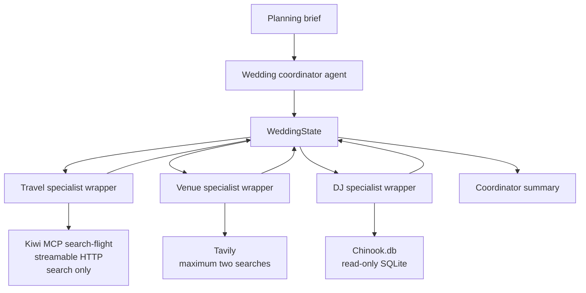

# Wedding Planner Architecture

## Inputs and outputs

- **Travel specialist input:** `origin`, `destination`, `outbound_date`, `return_date`, and `flight_adults` from `WeddingState`. Output: the actual Kiwi search response, preserving dates, currency, passenger count, and price basis. Booking links are not surfaced as actions.
- **Venue specialist input:** `destination` and `guest_count` from `WeddingState`. Output: up to two Tavily result records with exact URLs and explicit unknown/partial evidence for price, capacity, and availability.
- **DJ specialist input:** `genre` from `WeddingState`. Output: up to eight rows from the read-only `Track`, `Artist`, and `Genre` tables with track name, artist, genre, duration, and no invented licensing or availability claims.
- **Coordinator:** saves the planning brief, delegates sequentially, stores specialist reports/statuses in state, and preserves errors and unknowns.
