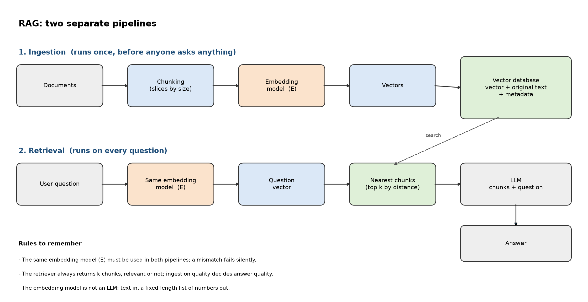

# RAG lesson tasks

## Two pipelines

Ingestion runs before questions: documents -> chunks -> embedding model -> vectors plus original text and metadata stored in a vector database.
Retrieval runs for each question: question -> same embedding model -> nearest chunks -> chunks and question in the LLM prompt -> answer.
The diagram is prepared; the separate course instruction to draw both from memory has not been demonstrated.

## Do I need RAG?

Conference preparation team: not for the current small set of paper, slides and notes if they fit in the chosen model's context. Passing those sources directly avoids an unnecessary retrieval stage.
UAV address verification: use structured address lookup and geospatial checks, not semantic retrieval as the authority for matching house numbers. Similar-looking addresses must not be treated as equivalent.

## How I would detect silent retrieval failure

- Run a small fixed evaluation set with known relevant document IDs and track recall at k.
- Log retrieved document IDs and similarity scores, not only fluent answers.
- Record embedding model/version and preprocessing when indexing and verify compatibility at query time; reindex on changes.
- Check whether cited chunks actually support answers and allow no-answer outcomes.
- Treat score shifts as a diagnostic, not sufficient proof of correctness.

No RAG implementation is claimed. The screenshot asks for a diagram, a need assessment and a Community answer about silent failure.
